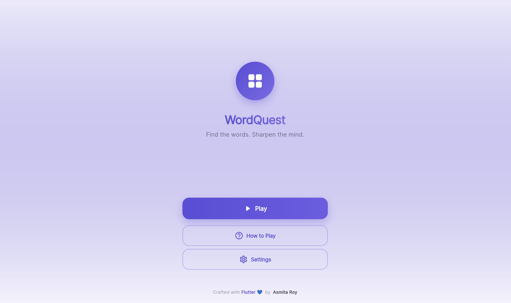
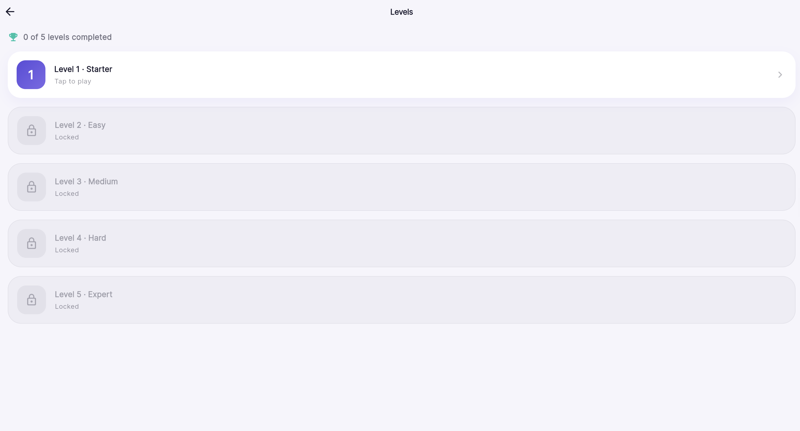
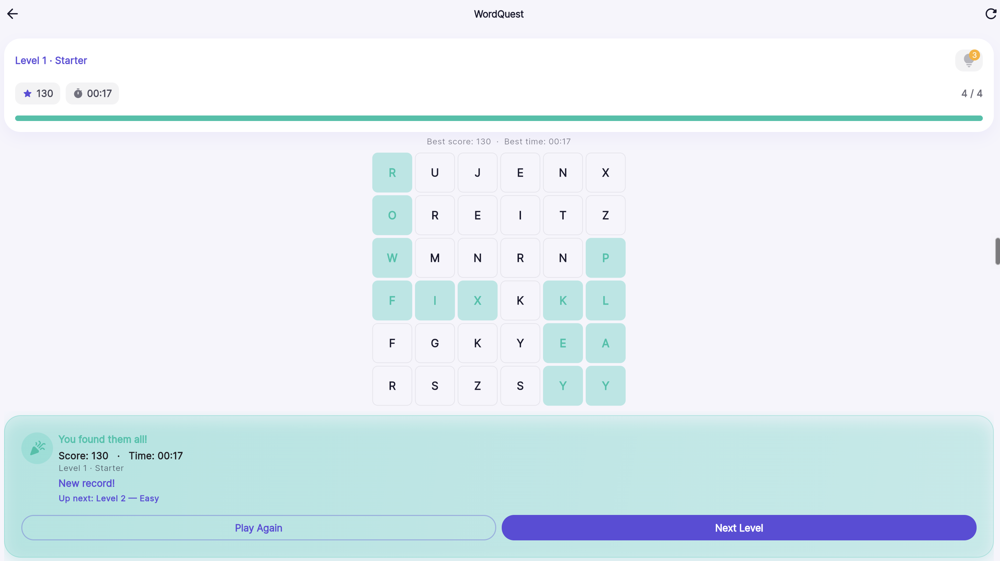
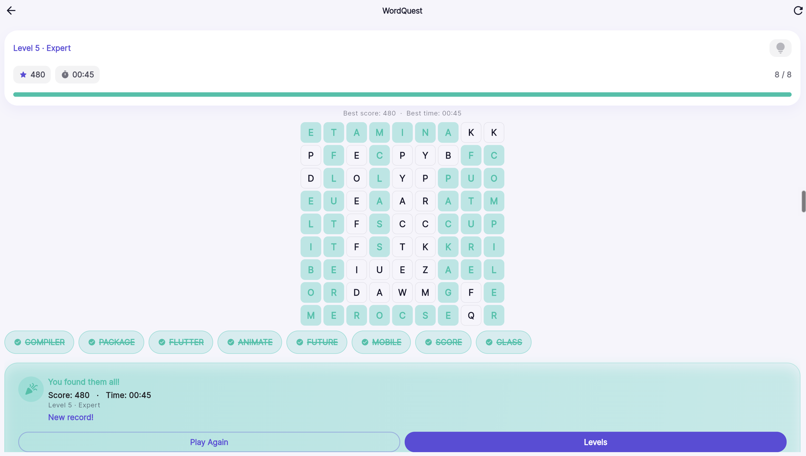

<div align="center">

# WordQuest

**A Flutter word-search puzzle game — five hand-tuned difficulty levels, drag-to-select gameplay, and progress that's saved right on your device.**

[](https://flutter.dev)
[](https://dart.dev)
[](https://wordquest-ashen.vercel.app)
[](https://wordquest-ashen.vercel.app)

**[Play it now → wordquest-ashen.vercel.app](https://wordquest-ashen.vercel.app)**

</div>

---

## Overview

WordQuest is a word-search puzzle game built entirely in Flutter. Find every hidden word in a letter grid by pressing and dragging in a straight line — horizontal, vertical, or diagonal, forwards or backwards — across five levels that get progressively larger and trickier.

Puzzles are generated on-device, while best scores and times are persisted locally using `shared_preferences`.

Repository: [github.com/techAsmita/WordQuest](https://github.com/techAsmita/WordQuest)

---

## Features

**Core gameplay**
- Press-and-drag letter selection across straight lines (horizontal, vertical, diagonal)
- Words can be hidden forwards *or* backwards depending on the level
- Puzzles are procedurally generated per level, with a fresh grid layout on every replay
- Scoring: 10 points per letter for each newly found word
- Hint system: 3 hints per level, each one briefly reveals an unfound word for a 15-point deduction

**Difficulty ladder**

Five levels, each widening the grid and unlocking new mechanics:

| Level | Name    | Grid | Words | Word length | Diagonals | Reversed words |
|:-----:|---------|:----:|:-----:|:-----------:|:---------:|:--------------:|
| 1 | Starter | 6×6 | 4 | 3–4 | – | – |
| 2 | Easy    | 7×7 | 5 | 3–5 | – | ✓ |
| 3 | Medium  | 8×8 | 6 | 4–6 | ✓ | – |
| 4 | Hard    | 8×8 | 7 | 4–7 | ✓ | ✓ |
| 5 | Expert  | 9×9 | 8 | 5–8 | ✓ | ✓ |

Levels unlock sequentially — clear one to open the next.

**Feedback & persistence**
- Light haptic + system-sound feedback on valid/invalid selections, hints, and level completion (toggleable in Settings)
- Best score and best time are saved per level and shown on replay
- "Reset progress" clears all saved records with a confirmation prompt
- Light and dark themes that follow the system setting

---

## Screenshots

<table>
<tr>
<td align="center" width="50%"><b>Home</b></td>
<td align="center" width="50%"><b>Level Select</b></td>
</tr>
<tr>
<td></td>
<td></td>
</tr>
<tr>
<td align="center"><b>Gameplay — Level 1 (Starter), cleared</b></td>
<td align="center"><b>Gameplay — Level 5 (Expert), cleared</b></td>
</tr>
<tr>
<td></td>
<td></td>
</tr>
</table>

---

## Tech Stack

| Layer | Technology |
|---|---|
| Framework | Flutter |
| Language | Dart (SDK ^3.2.0) |
| Routing | [go_router](https://pub.dev/packages/go_router) |
| Typography | [google_fonts](https://pub.dev/packages/google_fonts) |
| Local persistence | [shared_preferences](https://pub.dev/packages/shared_preferences) |
| Icons | cupertino_icons |
| Testing | flutter_test |
| Static analysis | flutter_lints |

No backend, database, or external API is used — WordQuest is a self-contained Flutter client.

---

## Getting Started

**Prerequisites**
- [Flutter SDK](https://docs.flutter.dev/get-started/install) `3.2.0` or newer
- Git

```bash
git clone https://github.com/techAsmita/WordQuest.git
cd WordQuest
flutter pub get
```

---

## Running Locally

```bash
# Run on Chrome (web)
flutter run -d chrome

# Or run on a connected device / emulator
flutter run

# Run the test suite
flutter test
```

---

## Web Deployment / Live Demo

The live demo is a static build hosted on Vercel:

**[wordquest-ashen.vercel.app](https://wordquest-ashen.vercel.app)**

The site is **not** built on Vercel's servers — Vercel doesn't have the Flutter SDK installed. Instead, the web build is produced locally and the compiled output is what gets deployed:

```bash
flutter build web --release
```

This generates a static `build/web` directory (HTML, JS, CSS, and assets) which is deployed as-is — Vercel just serves those files, no Flutter build step required on its end.

---

## Project Structure

<details>
<summary>Expand to view the folder layout</summary>

```
lib/
├── main.dart                     # App entry point, theme + router setup
├── core/
│   ├── router/                   # go_router route definitions (AppRouter)
│   ├── storage/                  # SharedPreferences-backed progress & settings repositories
│   ├── theme/                    # Light/dark AppTheme
│   ├── audio/                    # GameFeedback (haptics + system sounds)
│   └── constants/                # Shared sizes and strings
└── features/
    ├── home/                     # Landing screen
    ├── levels/                   # Level select screen
    ├── game/
    │   ├── domain/                # GameController, PuzzleGenerator, LevelCatalog, WordBank
    │   └── presentation/          # Game screen, letter grid, word list, score bar
    └── settings/                  # Sound toggle, reset progress
```

Feature folders are split into `domain` (game logic, pure Dart, unit-tested) and `presentation` (widgets/screens) where the feature is complex enough to warrant it.

</details>

---

## Future Enhancements

Not implemented today — noted here as possible directions, not commitments:

- Custom or user-submitted word lists / themed word packs
- Online or shareable leaderboards (would require adding a backend)
- Additional grid sizes or levels beyond the current five
- Custom sound effects in place of the current system sounds
- Localization for languages beyond English

---

## Author

**Asmita Roy**
[github.com/techAsmita](https://github.com/techAsmita)

Built as a portfolio project to demonstrate Flutter architecture, game-state management, responsive UI, persistence, and deployment.